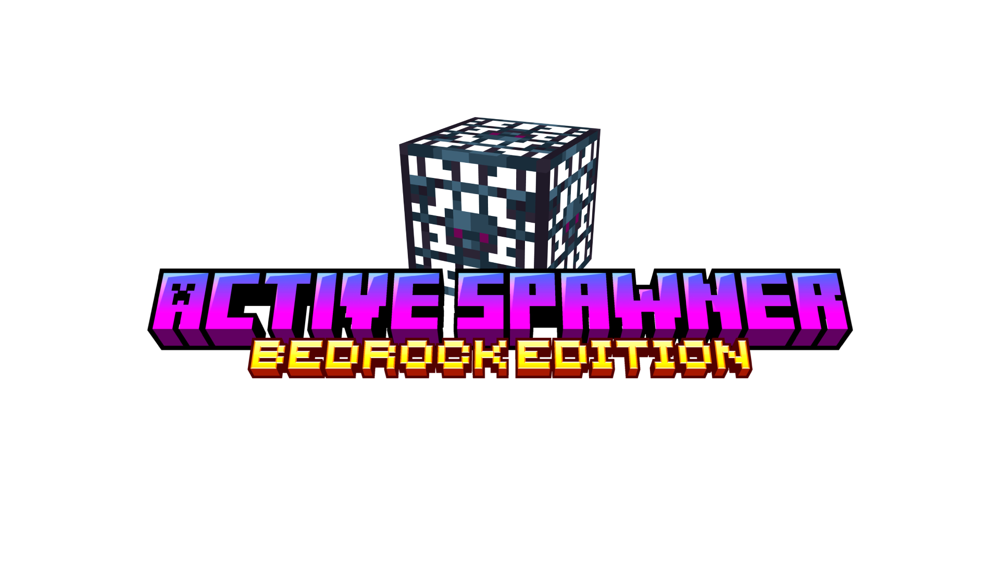
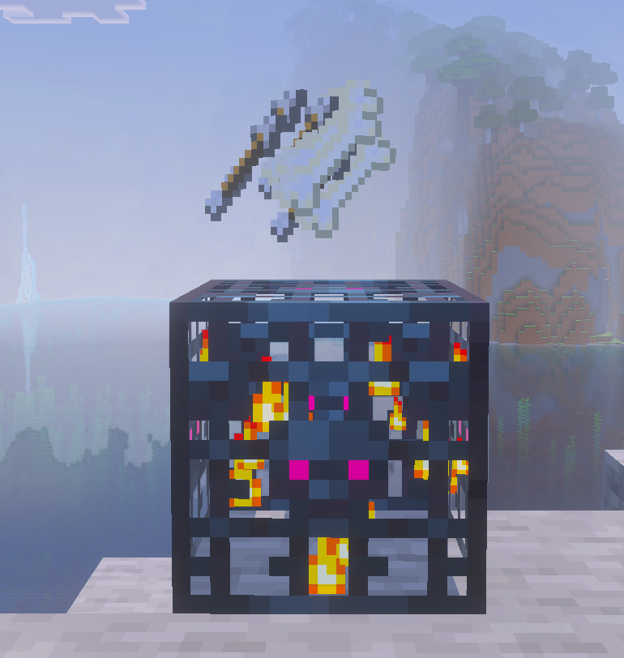
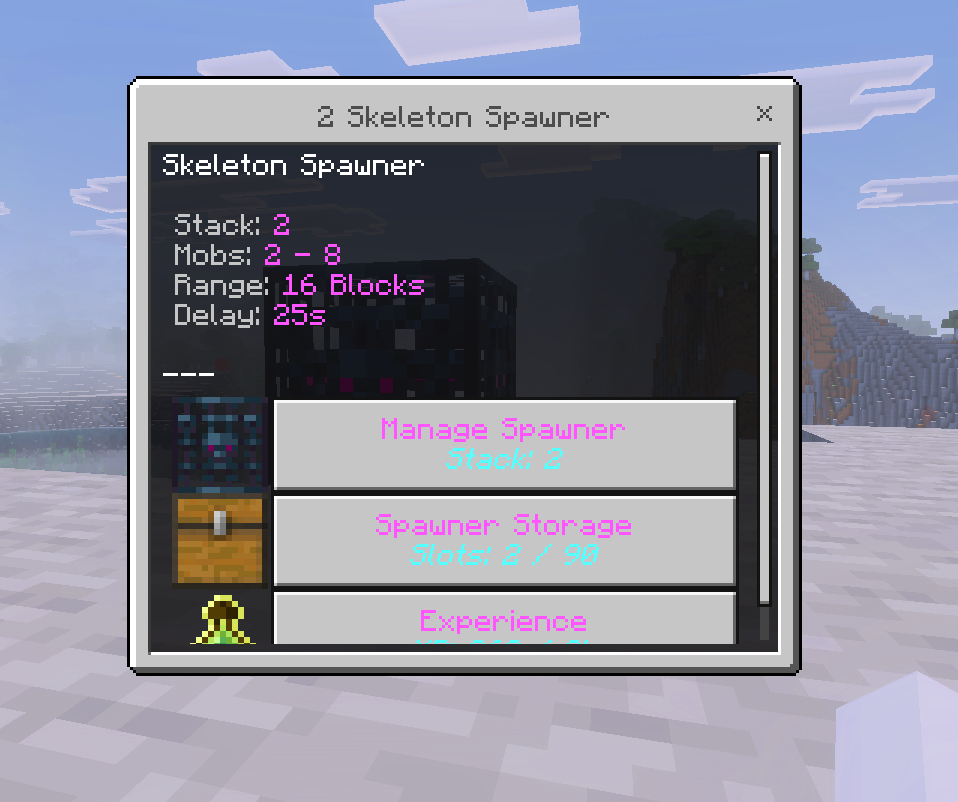
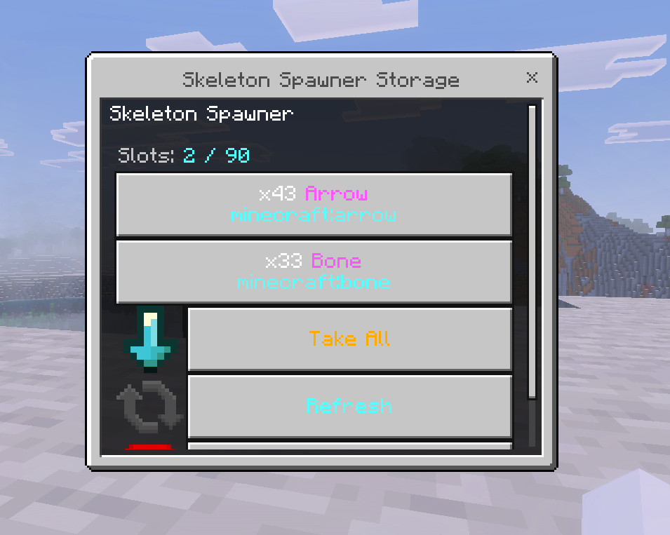
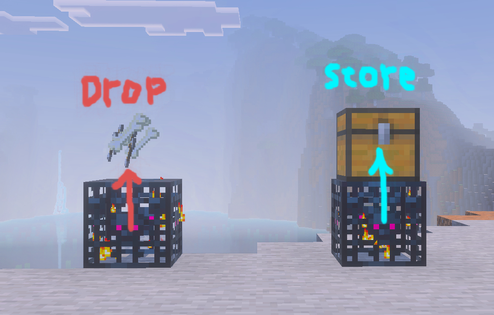
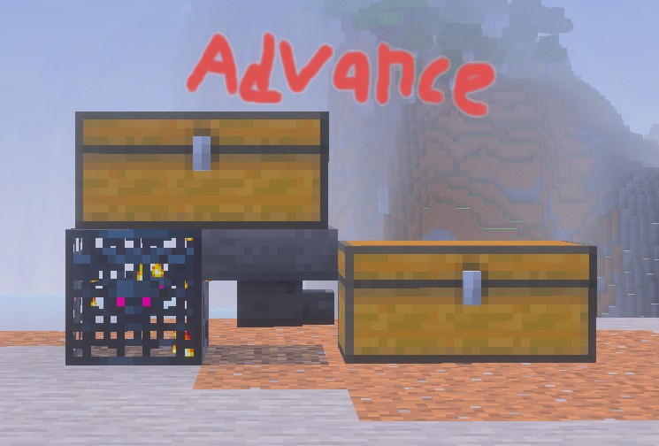

# ActiveSpawner (Bedrock Edition)

This is the ActiveSpawner addon, created for Bedrock Edition. Inspired by DonutSMP's spawner mechanism. Built in with Spawner Custom Loot. And with the Dynamic Loot System, most mob drops are already registered.

# Features

Its features are similar to DonutSmp Spawner, generating loot every few seconds, having loot storage, and upgradable stacks. However, it adds several additional features, including Configuration, Custom Loot, and Loot Auto Store.

## Spawner

This addon build-in with simple ui that can be customizable in configuration

## Loot Store

Players can place a container block above the spawner to auto-store the items when players collect the loot. Support all blocks that have inventory component. (Chest, Trapped Chest, Shulker Box, Barrel, etc.)

## Custom Loot

To customize a loot you can use the /ssloot commands. Making a README.md makes me more tired than making the addon so you can just [click this](#commands) to see the commands. And feel free to contribute :D

# Commands

| Command | Description |
|--------|-------------|
| `/givespawner <EntityType> [Amount] [Player]` | Give a Active Spawner with the specified entity type. |
| `/ssloot reload` | Reload all ActiveSpawner loot configurations. |
| `/ssloot list` | Show a list of all EntityTypes that have custom loot. |
| `/ssloot check <EntityType>` | View custom loot data for the specified entity. |
| `/ssloot create <EntityType> [hand\|hotbar\|inventory]` | Create custom loot using items from hand, hotbar, or inventory. |
| `/ssloot delete <EntityType>` | Delete the custom loot of the entity. |
| `/ssloot set <EntityType> xp <amount>` | Set experience value for the entity’s custom loot. |
| `/ssloot add <EntityType> <hand\|hotbar\|inventory>` | Add items from the selected source to custom loot. |
| `/ssloot set <EntityType> <hand\|hotbar\|inventory>` | Replace custom loot with items from the selected source. |
| `/ssloot clear <EntityType>` | Clear all custom loot items. |
| `/ssloot add <EntityType> table <TablePath>` | Add a loot table to the entity’s custom loot. |
| `/ssloot set <EntityType> table <TablePath>` | Replace entity loot using a loot table. |
| `/ssloot clear <EntityType> table` | Remove all loot tables from the entity’s custom loot. |

# Information
  
- Author: ItzCandra23 ([github.com/ItzCandra23](https://github.com/ItzCandra23))
- Contributor: FEEL FREE TO CONTRIBUTE :D
- Licens: **[MIT License](./LICENSE)**
- Discord: [discord.gg/naRZ8tE3yC](https://discord.gg/naRZ8tE3yC)

---